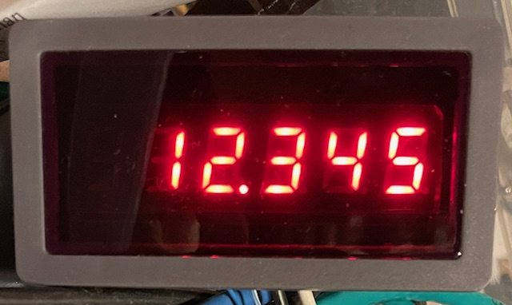

# LED-485_setuptool
Change modbus settings and write text etc. on RS485 displays e.g. LED-485-046





## Features
- Write a number (integer or decimal) in the display
- Change baudrate and modbus unit id ("modbus address")

More features, e.g. writing text, might come in the future.

Both a serial device (e.g. USB RS485 adaptor) and modbus gateway is supported.

## Supported models
There are a number of different models (listed here for reference).

Feel free to send me a display for me to test on.

### Tested
- LED-485-046: 6-digit red
- LED-485-046: 6-digit blue

(well technically I have only tested the red one... :)

### Untested
- LED-485-083: 3-digit red
- LED-485-054: 4-digit red
- LED-485-055: 5-digit red
- LED-485-083: 3-digit blue
- LED-485-054: 4-digit blue
- LED-485-055: 5-digit blue

## Notes
The display ships from the manufacturer with modbus unit id ("modbus address") 1 and baudrate 9600 8N1

## Dependencies

```pip3 install pymodbus pyserial```

## Usage

## Examples
Write the value 12.345 in the display:
```
$ ./led-485_setuptool.py --serial-port /dev/ttyUSB0 --decimal-point 3
Starting the LED-485 setuptool programm
Display: "3" Position of decimalpoint
```
(decimal point is saved until the display looses power)
```
$ ./led-485_setuptool.py --serial-port /dev/ttyUSB0 --value 12345
Starting the LED-485 setuptool programm
Display: "12345" 16-bit signed integer (see also the decimal point setting)
```

Change the baudrate from 9600 to 19200:
```
$ ./led-485_setuptool.py --serial-port /dev/ttyUSB0  --baudrate 9600 --set-baudrate 19200
Starting the LED-485 setuptool programm
Setting the baudrate to 19200
```

Change the unit id from 1 to 5 (unit id is also sometimes referred to as "modbus address" or "slave id")
```
$ ./led-485_setuptool.py --serial-port /dev/ttyUSB0 --unit-id 1 --set-unit-id 5
Starting the LED-485 setuptool programm
Setting the unit id ("modbus address") to 5
```