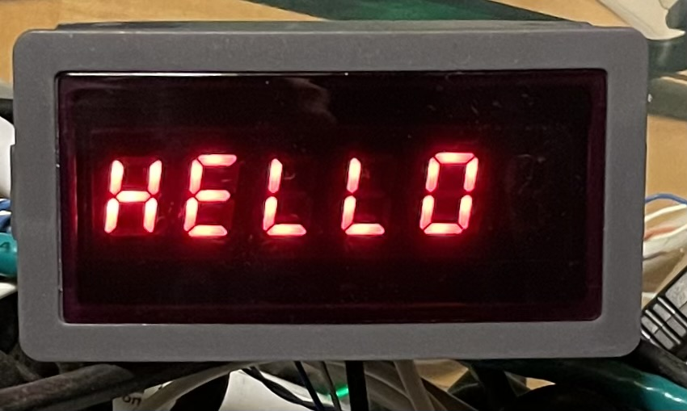

# LED-485_setuptool
Change modbus settings and write text etc. on RS485 displays e.g. LED-485-046

## Features

## Supported models
There are a number of different models (listed here for reference).

Feel free to send me a display for me to test on.

### Tested
- LED-485-046: 6-digit red

### Untested
The six digits versions should work.

The 3-5 digits versions may need some fine tuning for all features (e.g. showing text)

- LED-485-083: 3-digit red
- LED-485-054: 4-digit red
- LED-485-055: 5-digit red
- LED-485-083: 3-digit blue
- LED-485-054: 4-digit blue
- LED-485-055: 5-digit blue
- LED-485-046: 6-digit blue

## Notes
The display shippes from the manufacturer with modbus unit id ("modbus address") 1 and baudrate 9600 8N1

## Installation

## Usage

## Examples